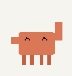
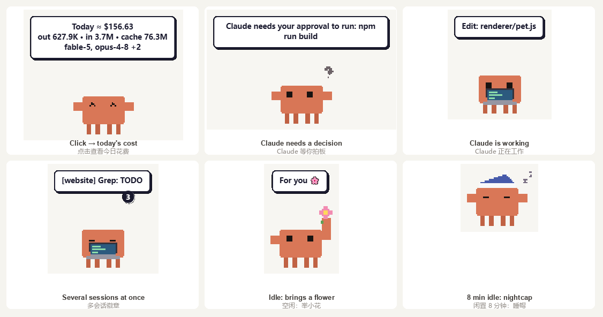
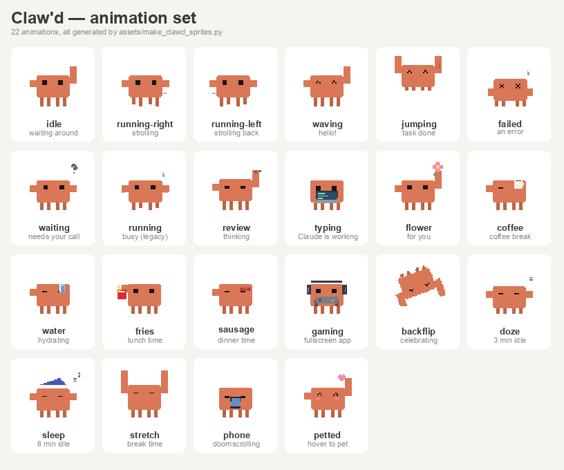

# 🦀 Claw'd — a Claude Code desktop pet

[English](README.md) · [简体中文](README.zh-CN.md)

A pixel crab that lives on your desktop, watches every Claude Code session on the machine, and tells you when a conversation is ready to move on.



- **Watches Claude Code** — hooks report tool calls, prompts and turn endings. The crab pulls out a laptop and types while Claude works.
- **Tells you when to come back** — a run longer than 15 s ends with a notification: *"Ready to move on — 「project」"*. Quick chat turns stay silent.
- **Click → today's spend** — token counts plus the API-equivalent cost for today, via [ccusage](https://github.com/ryoppippi/ccusage) (offline pricing, nothing leaves your machine).
- **Roams your desktop** — strolls the bottom edge, climbs the screen sides, naps, snacks by time of day, and falls back down if you drop it mid-air.
- **Stays out of the way** — when a fullscreen app is in front it tucks half off-screen and becomes click-through, wearing headphones and holding a gamepad.
- **Keeps you company** — hover to pet it (hearts), a stretch reminder after 50 minutes at the keyboard, and a badge when several Claude sessions run at once.

<br clear="right">

## What it looks like



## Animations

All 22 animations are generated by `assets/make_clawd_sprites.py` — no external art, no traced assets.



| Trigger | What it does |
| --- | --- |
| Claude is working | types on a laptop; sips coffee every 25 min on long runs |
| Turn finished | jumps, or a backflip half the time |
| Claude needs a decision | blinks and waits, bubble stays until you act |
| Idle | strolls, climbs walls, snacks (coffee / water / fries / sausage by time of day), smells a flower, doomscrolls |
| 3 / 8 min without input | dozes off, then sleeps with a nightcap |
| Input returns | wakes with a stretch and a time-of-day greeting |
| 50 min of activity | stretch-break reminder |
| Fullscreen app | tucks to the edge, headphones + gamepad |
| Hover 1.2 s | gets petted, hearts float up |

## Install

Grab the packaged app from [Releases](../../releases) — unzip and run `Clawd.exe` (Windows x64, no installer).

Then register the Claude Code hooks so the crab can see your sessions:

```bash
npm run hooks:install
```

This adds seven hooks to `~/.claude/settings.json` (a backup is written to `settings.json.ccpet-bak`) and takes effect for newly started Claude Code sessions. To undo:

```bash
npm run hooks:uninstall
```

> The hooks point at this folder's `hooks/notify.js`, so keep the repo where it is (or re-run `hooks:install` after moving it).

## Run from source

```bash
npm install
npm start          # dev
npm run build      # dist/Clawd-win32-x64/Clawd.exe
```

Requires Node.js 18+. Windows only for now — the fullscreen watcher and start-with-Windows use Win32 APIs; the rest is portable.

## Using it

- **Left click** — today's usage and cost
- **Drag** — move it; drop it in mid-air and it falls
- **Hover** — petting
- **Right click / tray icon** — usage, roaming, hide at screen edge, tricks, start-with-Windows, restart, quit

"Hide at screen edge" parks the crab half off the right edge and makes it click-through, so it is visible but never in the way — the same thing it does by itself when a fullscreen app is in front.

## Sprite art

`assets/make_clawd_sprites.py` renders the whole sheet plus `icon.ico` / `tray.png`; `assets/make_preview.py` renders the images in this README. Both need Python 3.11+ with Pillow.

The sheet follows the Codex Pet Standard (8 columns × 192×208 cells): rows 0–8 are the standard set, rows 9–21 are this project's extensions. Replacing `renderer/spritesheet.webp` swaps the character; the right-click menu can also import a `.zip` pet pack.

## How it works

```
Claude Code hook ──> hooks/notify.js ──POST──> 127.0.0.1:31126/status
                                                      │
                                            main.js (Electron main)
                                        window · tray · ccusage · watchers
                                                      │ IPC
                                            renderer/pet.js
                                     animation engine · roaming · menu
```

| Path | Role |
| --- | --- |
| `main.js` | window, tray, HTTP status server, ccusage, fullscreen + idle watchers |
| `preload.js` | IPC bridge |
| `renderer/pet.js` | animation engine, roaming/climbing/hiding, menu actions |
| `hooks/notify.js` | maps hook events to `idle` / `running` / `waiting` / `completed` / `error` |
| `scripts/setup-hooks.js` | install / uninstall the hooks |
| `scripts/fullscreen-watch.ps1` | foreground-window watcher, prints `FS:0` / `FS:1` |

Push a status by hand:

```bash
curl -X POST http://127.0.0.1:31126/status -H "Content-Type: application/json" -d "{\"status\":\"running\",\"message\":\"hello\"}"
```

`GET /status`, `GET /usage`, and `POST /action`, `/fullscreen`, `/idle`, `/restart` are also available on localhost for testing.

## Credits

Forked from [ClaudeCodePet](https://github.com/WangJunqing-coder/ClaudeCodePet) (MIT) and largely rewritten. Sprite format follows the [Codex Pet Standard](https://codexpet.xyz).

"Claw'd" is Anthropic's mascot; this is an unofficial, independently drawn homage and is not affiliated with or endorsed by Anthropic.

## License

MIT — see [LICENSE](LICENSE). The generated sprite art is MIT too.
