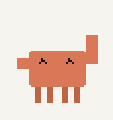
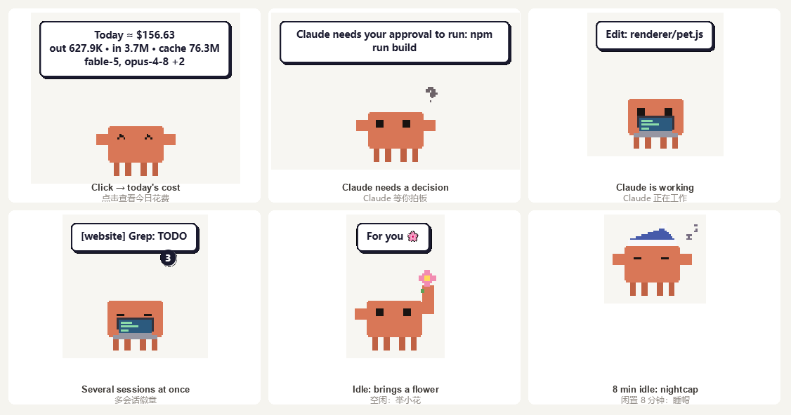
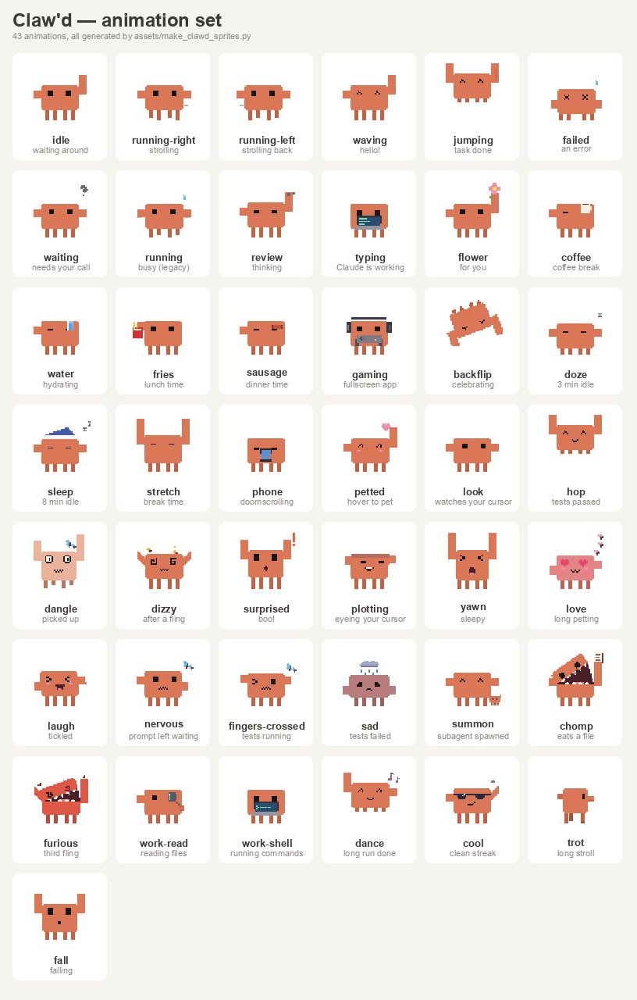

# 🦀 Claw'd — Claude Code 桌面宠物

[English](README.md) · [简体中文](README.zh-CN.md)

一只住在桌面上的像素螃蟹，盯着这台机器上所有 Claude Code 会话，在某个话题可以推进时叫你回来。



- **盯着 Claude Code** —— 通过 hooks 接收工具调用、提问和轮次结束事件。Claude 干活时，螃蟹会掏出笔记本敲键盘；翻文件时拿放大镜跟着看，跑命令时对着终端猛敲。
- **对 Claude 的动作有反应** —— 跑测试时双手合十祈祷，测试通过就蹦一下、头顶光环，失败了就蹲在小雨云下面；派出子智能体时从烟雾里召唤一只小螃蟹；一轮结束会庆祝一下（蹦跳、跳舞，连续几轮都干净利落还会戴上墨镜）。菜单里 *Reactions: Off* 可以关掉这些反应。
- **该回来时叫你** —— 跑了超过 15 秒的轮次结束时弹通知：*「Ready to move on — 项目名 is ready for you」*；秒回的闲聊轮次保持安静。
- **会换装** —— 一衣柜的帽子：*Auto* 模式按节日自动换（圣诞节戴圣诞帽、万圣节前后戴猫耳、冬天早上戴毛线帽），长时间工作戴安全帽、再久一点绑头巾，计划模式戴巫师帽；也可以自己挑一顶。
- **点一下看这周花了多少** —— 一张小卡片：本周（周一到周日）每天的 API 等价费用曲线，下面是每天的 token 用量，数据来自 [ccusage](https://github.com/ryoppippi/ccusage)（离线定价，不联网、数据不出本机）。`ccusage-pricing.json` 给 ccusage 自带价格表里还没有的新模型补上官方价格，免得记成 $0。
- **在桌面自由活动** —— 沿底边散步、爬屏幕两侧的「墙」、打盹、按时段吃点东西；被拎到半空松手会掉下来。
- **自觉让路** —— 检测到全屏应用时，爬上屏幕右缘、下半身滑出屏幕外只露个头，变成点击穿透，戴上耳机拿起手柄。
- **陪着你** —— 鼠标悬停可以摸头（冒爱心）、在它身上来回晃鼠标是挠痒痒、鼠标靠近时它的眼睛会跟着转、连续用键盘 50 分钟提醒起来活动、同时开多个 Claude 会话时显示数量徽章。
- **有身体有重量** —— 拎起来会晃荡（甩得太猛会慌），松手会掉下去、落地一蹲；甩出去会飞、撞屏幕边缘反弹、翻滚、晕乎乎地落地（2 分钟内甩第三次它会生气）。它还会爬上 Claude 窗口（或你正在用的窗口）的侧边，在标题栏上坐一会儿。
- **会吃文件** —— 把文件拖到它身上，它会张开盖子；松手它就一口吃掉，并报告味道：*"Crunchy! pet.js: 1,870 lines, 64 KB"*。只读文件大小和行数。
- **有一点点坏** —— 走路会留下渐渐消失的泥爪印；你离开鼠标一小会儿，它可能溜过来把光标叼走跑掉——你一动鼠标它立刻松手。菜单里 *Mischief: Off* 可以全部关掉。

<br clear="right">

## 实际长这样



## 动画

全部 43 组动画都由 `assets/make_clawd_sprites.py` 参数化生成 —— 没有外部素材，没有描摹。同一个脚本还画了 17 个表情符号（在头旁边弹出的小标记：`!`、`?`、灯泡、汗滴、爱心、雨云、工具图标……）和 12 顶帽子。



第 0–21 行是原有的一套（待机、走路、挥手、跳跃、敲键盘、吃东西、打游戏、后空翻、打瞌睡、睡觉、伸懒腰、被摸头……）。第 22–42 行是新加的：`look`、`hop`、`dangle`、`dizzy`、`surprised`、`plotting`、`yawn`、`love`、`laugh`、`nervous`、`fingers-crossed`、`sad`、`summon`、`chomp`、`furious`、`work-read`、`work-shell`、`dance`、`cool`、`trot`、`fall`，另外还有从它们里截出来的 8 个变体（`hop-land`、`dangle-scared`、`startle`、`busted`、`summon-return`、`chomp-open`、`trot-stop`、`squint`）。

### 桌面上

| 触发条件 | 表现 |
| --- | --- |
| 空闲 | 横着散步、爬墙、按时段吃东西（咖啡 / 水 / 薯条 / 香肠）、举小花、刷手机；鼠标靠近时眼睛跟着转 |
| 2.5 / 3 / 8 分钟无输入 | 打个哈欠，然后打瞌睡，再戴上睡帽睡着 |
| 重新有输入 | 伸个懒腰醒来，说一句按时段的招呼语 |
| 连续活动 50 分钟 | 提醒起来活动一下 |
| 全屏应用 | 挂在屏幕右缘只露头，戴耳机拿手柄 |
| 悬停 1.2 秒（再多 6 秒） | 被摸头，冒爱心（然后幸福得化掉） |
| 在它身上来回晃鼠标 | 被挠痒痒，哈哈大笑 |
| 被拎起来 | 挂在光标下晃荡；甩得太快或靠近屏幕边缘时会慌 |
| 松手 | 掉下去，落地一蹲 |
| 被甩出去（拖动中快速松手） | 飞出去、反弹、翻滚、晕乎乎落地，之后一分钟脚上带泥；2 分钟内第三次会气炸，第四次它不干了 |
| 文件拖到它身上 | 张开盖子（"Ooh, food?"）；松手就吃掉，报告文件大小和行数 |
| 空闲且附近有窗口 | 爬上窗口侧边，坐在标题栏上挪来挪去，然后跳下来 |
| 鼠标 25 秒–2 分钟没动 | 先打坏主意，然后可能偷走光标跑掉（每 20 分钟最多一次）；被抓包时一脸心虚 |

### 盯着 Claude Code

| 触发条件 | 表现 |
| --- | --- |
| Claude 正在工作 | 抱着笔记本敲键盘；连着 Read / Grep / Glob 时换成拿放大镜看，连着 Bash 时换成对着终端敲（每个姿势至少保持 8 秒）；长时间运行时每 25 分钟抿一口咖啡 |
| 新的提问 | "Thinking..." 旁边冒出一个灯泡 |
| 换了一类工具 | 一个小工具图标（最多每 30 秒一次） |
| 开始跑测试（`npm test`、`pytest`、`cargo test`、`go test`……） | 双手合十祈祷 |
| 测试通过 | 蹦一下，头顶光环 10 秒 |
| 测试失败 | 一朵小雨云，外加 "Tests failed. We got this." |
| 派出子智能体 / 全部回来 | 从烟雾里召唤出一只小螃蟹 / 收回去 |
| `git commit` / `git push` | 一个绿色对勾 / 一颗闪光 |
| Claude 等你拍板 | 闪烁等待，气泡一直留着直到你处理；等了 30 秒开始紧张 |
| 离开 Claude 20 分钟以上再回来 | 吓一跳 |
| 上下文被压缩 | 啊呜一口："Munched the old context!" |
| `/clear` / 恢复会话 | "Fresh start!" / 挥手："Welcome back!" |
| 一轮结束 | 短轮次蹦一下，长一点的跳跃、后空翻或跳舞；连续几轮干净利落时戴上墨镜 |
| 长时间工作 / 计划模式 | 2 分钟后戴安全帽，8 分钟后绑头巾 / 戴巫师帽 |

同时开着多个会话时，只有你最后一次提问的那个会话驱动这些反应（任何会话的权限请求都照样会提醒你）。菜单里 *Reactions: Off* 会关掉整张表，只保留原来的敲键盘 / 等待 / 跳跃；上面「桌面上」的行为不受影响。

这些反应需要本版本的 hook：见[更新](#更新)。用旧的 `hooks/notify.js` 时，螃蟹还是和以前一样只会敲键盘、等待、跳跃。

## 安装

从 [Releases](../../releases) 下载打包好的程序，解压后运行 `Clawd.exe`（Windows x64，免安装）。

然后注册 Claude Code hooks，让螃蟹能看到你的会话：

```bash
npm run hooks:install
```

这会往 `~/.claude/settings.json` 写入 7 个 hook（原文件备份到 `settings.json.ccpet-bak`），对**新启动**的 Claude Code 会话生效。撤销：

```bash
npm run hooks:uninstall
```

> hooks 指向的是本目录下的 `hooks/notify.js`，所以别移动这个文件夹（移动后重新执行一次 `hooks:install` 也可以）。

### 更新

每个 Claude Code 会话的每次工具调用都会跑 `hooks/notify.js`，所以新版本不直接改它，而是放在旁边的 `hooks/notify.next.js`，再用脚本换上去：

1. 从菜单退出 Claw'd。
2. 执行 `npm run build`，然后重新启动 `dist/Clawd-win32-x64/Clawd.exe`。
3. 启用新 hook：

   ```bash
   node scripts/activate-notify.js
   ```

   它会把 `notify.next.js` 复制成 `notify.js.new`、做语法检查、往里灌一个样例事件（发到没人用的开发端口 31127，绝不会发给桌宠）、把当前的 hook 留作 `hooks/notify.prev.js`（只在第一次启用时写；`notify.next.js` 已经在用时再跑一次什么也不做），再把新文件重命名覆盖 `hooks/notify.js`（如果正好有 hook 在读这个文件，会稍等片刻重试）。`node scripts/activate-notify.js --rollback` 可以换回旧 hook。
4. 在 Claude Code 里随便调用一次工具，确认 `http://127.0.0.1:31126/status` 里出现了这次调用。

新 hook 只在发送的内容里多加几个简短标签（工具类别；shell 命令是 `test` / `git-commit` / `git-push` 中的哪一种；测试跑完是通过还是失败；通知类型；权限模式），绝不包含命令原文、提问内容或输出。它的气泡文字也改成了英文。

**可选，由你决定：** 再注册三个 hook 事件能让「测试失败」和「用量上限」的反应更可靠 —— `PostToolUseFailure`（目前测试失败是靠下一个事件推断出来的）、`StopFailure` 和 `PreCompact`。没有任何东西会自动注册它们（`hooks:install` 只注册上面那 7 个）。想加的话，在 `~/.claude/settings.json` 的 `hooks` 里加上类似下面的条目，路径和你其他 Claw'd hook 一致：

```json
"PostToolUseFailure": [{ "matcher": "", "hooks": [{ "type": "command", "command": "node \"<repo>/hooks/notify.js\" PostToolUseFailure", "timeout": 10 }] }],
"StopFailure": [{ "hooks": [{ "type": "command", "command": "node \"<repo>/hooks/notify.js\" StopFailure", "timeout": 10 }] }],
"PreCompact": [{ "hooks": [{ "type": "command", "command": "node \"<repo>/hooks/notify.js\" PreCompact", "timeout": 10 }] }]
```

重新执行 `hooks:install` 会把它们清掉。

## 从源码运行

```bash
npm install
npm start          # 开发模式
npm run build      # 产物在 dist/Clawd-win32-x64/Clawd.exe
```

需要 Node.js 18+。目前仅支持 Windows —— 全屏检测和开机自启用到了 Win32 API，其余部分是跨平台的。

## 怎么用

- **左键点击** —— 本周费用曲线和每天的 token 用量；鼠标停在某天上看当天明细，点卡片关闭
- **双击** —— 把 Claude 桌面应用拉到前台（没开着就启动它）
- **拖动** —— 换位置；在半空松手它会掉下去；拖动中快速松手就是把它甩出去
- **悬停** —— 摸头；在它身上来回晃鼠标是挠痒痒
- **把文件拖到它身上** —— 它会吃掉文件，告诉你大小和行数
- **右键 / 托盘图标** —— 用量、自由活动开关、躲到屏幕边缘、捣蛋开关、反应开关、才艺表演、衣柜、开机自启、重启、退出

右键菜单里：

- **🔔 Reactions: On / Off** —— 对 Claude Code 的反应（见[盯着 Claude Code](#盯着-claude-code)），保存在 `pet-config.json`。
- **🎭 Tricks** —— 挥手、跳、后空翻、思考、小花、零食、午睡、💃 跳舞、😎 耍酷、😲 吓一跳、🍱 啊呜、💕 爱心、😪 哈欠，以及「把我甩出去 / 爬上窗口 / 偷光标」。
- **👒 Wardrobe** —— *Auto (seasonal)*（默认：12 月 20–26 日圣诞帽，除夕和元旦派对帽，10 月 25–31 日猫耳，2 月 14 日蝴蝶结，冬天上午毛线帽，外加长时间工作和计划模式的工作帽子）、*None*（不戴），或固定一顶：派对帽、礼帽、王冠、毛线帽、圣诞帽、巫师帽、猫耳、蝴蝶结、墨镜、安全帽。保存在 `pet-config.json`；换成导入的宠物时这一项变灰。
- **🦀 Built-in Claw'd** —— 仅在使用导入的宠物时出现：换回螃蟹。

「躲到屏幕边缘」会让螃蟹爬上屏幕右缘挂着、下半身藏在屏幕外，并变成点击穿透 —— 看得见但绝不挡事、也点不到。这和检测到全屏应用时它自动做的是同一件事。

## 螃蟹不见了怎么办

它会自己照看自己：

- **渲染进程崩溃或卡死** —— 窗口自动重新加载；反复崩溃时会逐步拉长间隔。
- **再运行一次 `Clawd.exe`** —— 桌宠还在跑时，会把丢了的螃蟹（窗口死掉、跑到屏幕外）找回来，而不是毫无反应。
- **整个程序退出了** —— 下一次 Claude Code hook 事件会把它重新拉起（最多每 2 分钟一次）；你从菜单 Quit 的除外。
- **从菜单 Quit** 之后，它会一直关着，直到你再运行 `Clawd.exe`，或者下次登录 Windows 时被「开机自启」带起来（想重启后也不出现，就取消勾选 *Start with Windows*）。在任务管理器里结束 `Clawd.exe` 算作崩溃，hooks 会把它拉回来。
- 在螃蟹上按 **Alt+F4** 不会关掉它，退出请用菜单。
- **开机自启**写进注册表 Run 键的路径带引号：路径含空格时，不会被恰好和路径前半截同名的杂散文件劫持。

想知道它为什么没了：看 `Clawd.exe` 旁边的 `logs\clawd.log`（启动、退出、崩溃、自动恢复，以及「上次没有正常退出」；`npm run build` 会重建 `dist/`，重新打包后日志从头开始），或者跑只读体检（发布包里在 `resources/app/scripts/doctor.ps1`）：

```bash
powershell -NoProfile -ExecutionPolicy Bypass -File scripts/doctor.ps1
```

## 精灵图

`assets/make_clawd_sprites.py` 生成整张精灵图以及 `icon.ico` / `tray.png`；`assets/make_preview.py` 生成本文档里的展示图。两者需要 Python 3.11+ 和 Pillow。

精灵图遵循 Codex Pet Standard（8 列 × 192×208 每格）：第 0–8 行是标准动作，第 9–42 行是本项目的扩展。生成脚本还会写出 `renderer/emotes.webp`、`renderer/hats.webp` 和 `renderer/clawd_meta.js`（帧时长、变体，以及帽子和表情符号定位用的头部 / 眼睛锚点）。替换 `renderer/spritesheet.webp` 就能换角色；右键菜单也支持导入 `.zip` 宠物包。行数较少的宠物包也能播放全部动画：每个新动作都会退回到第 0–8 行中的某一行（导入的宠物不戴帽子）。

## 工作原理

```
Claude Code hook ──> hooks/notify.js ──POST──> 127.0.0.1:31126/status
                                                      │
                                            main.js（Electron 主进程）
                                        窗口 · 托盘 · ccusage · 各种监视器
                                                      │ IPC
                                            renderer/pet.js
                                        动画引擎 · 漫游 · 菜单
```

| 路径 | 职责 |
| --- | --- |
| `main.js` | 窗口、托盘、HTTP 状态服务、ccusage、全屏与闲置监视 |
| `ccusage-pricing.json` | ccusage 价格覆盖：它自带价格表里还没有的模型 |
| `preload.js` | IPC 桥接 |
| `renderer/pet.js` | 动画引擎、反应调度（决定谁来选当前动作：手势、等你拍板的请求、测试结果、工作姿势、空闲小动作）、漫游/爬墙/躲避、菜单动作 |
| `renderer/overlay.js` | 每一帧帽子和表情符号放在哪（纯计算，和 QA 预览共用） |
| `renderer/clawd_meta.js` | 生成文件：第 22–42 行、变体、锚点、表情符号和帽子表 |
| `hooks/notify.js` | 把 hook 事件映射成 `idle` / `running` / `waiting` / `completed` / `error` |
| `hooks/notify.next.js` | 下一版 `notify.js`：多发反应用的标签；用 `scripts/activate-notify.js` 启用 |
| `scripts/setup-hooks.js` | 安装 / 卸载 hooks |
| `scripts/activate-notify.js` | 把 `notify.next.js` 换成正在用的 hook（先检查、留备份、可 `--rollback`） |
| `scripts/fullscreen-watch.ps1` | 窗口监视：全屏状态（`FS:`）和用于上窗的窗口位置（`WIN:`） |
| `scripts/cursor-helper.ps1` | 偷光标时负责移动鼠标 |
| `scripts/focus-claude.ps1` | 把 Claude 应用拉到前台 / 启动它 |
| `scripts/doctor.ps1` | 只读体检：进程、窗口、开机自启项、hooks、日志、Windows 崩溃记录 |
| `renderer/trail.*` | 画渐隐脚印的点击穿透覆盖层 |

手动推送状态：

```bash
curl -X POST http://127.0.0.1:31126/status -H "Content-Type: application/json" -d "{\"status\":\"running\",\"message\":\"hello\"}"
```

本地还开放了 `GET /status`、`GET /health`、`GET /usage`，以及 `POST /action`、`/fullscreen`、`/idle`、`/restart`、`/debug/crash-renderer`、`/debug/usage`（用给定数据显示卡片，发 `null` 恢复）用于调试。

从源码运行（或设置 `CLAWD_DEBUG=1`）时，`/debug/` 下还有一组 QA 接口（`anim`、`hook`、`emote`、`hat`、`date`、`cursor`、`skin`、`state`、`capture`、`drop`）；每个请求都必须带请求头 `X-Clawd-Debug: 1`，网页调不到。`tools/qa/dev/start_dev.ps1` 会在真桌宠旁边再起一只开发用的副本（端口 31127、独立配置、捣蛋和漫游默认关闭），用 `tools/qa/dev/stop_dev.ps1` 停掉；`CLAWD_PORT=31127 node hooks/notify.next.js PreToolUse < event.json` 可以给它喂一个 hook 事件。

## 致谢

Fork 自 [ClaudeCodePet](https://github.com/WangJunqing-coder/ClaudeCodePet)（MIT）并大幅重写。精灵图格式遵循 [Codex Pet Standard](https://codexpet.xyz)。表情词汇（眼型与嘴型、头顶符号、帽子、饭盒盖嘴、手绘关键视角转身、反应与挤压拉伸的节奏）借鉴自 John Heibel 的 [ClaudeAnimationBase](https://github.com/JohnHeibel/ClaudeAnimationBase)（MIT），在这里重画为像素风。

「Claw'd」是 Anthropic 的吉祥物；本项目是非官方的独立绘制致敬作品，与 Anthropic 无关联、未获其背书。

## 许可证

MIT —— 见 [LICENSE](LICENSE)。生成的精灵图同样采用 MIT。
